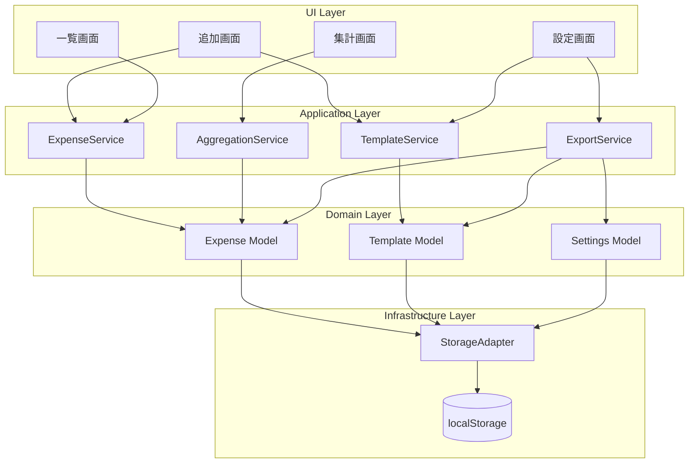
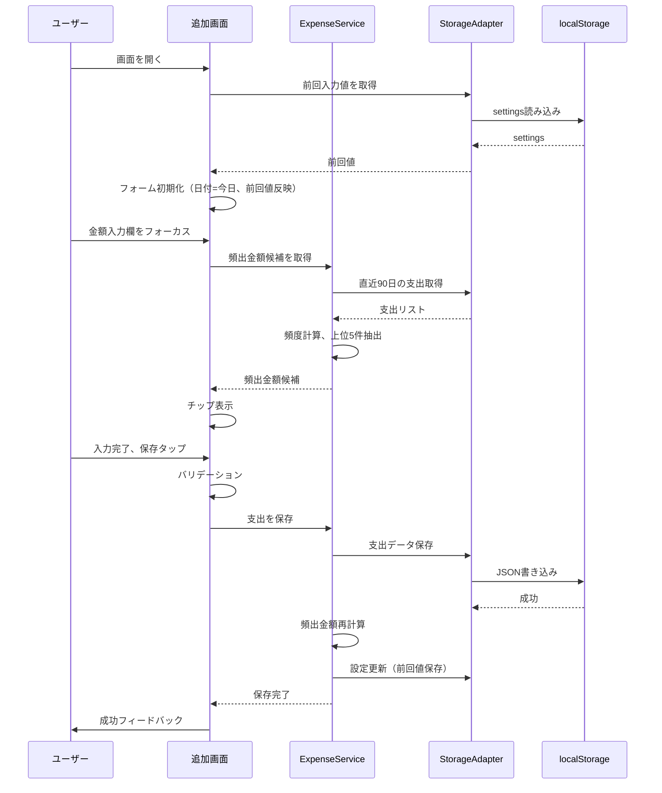
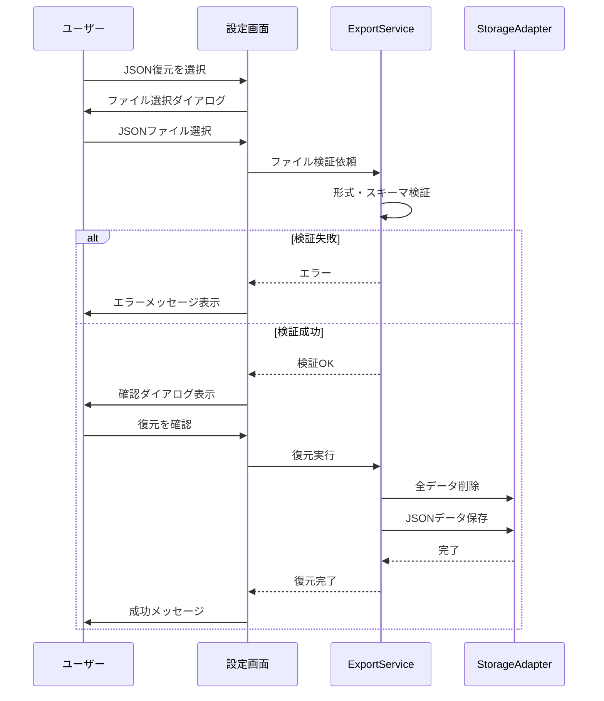
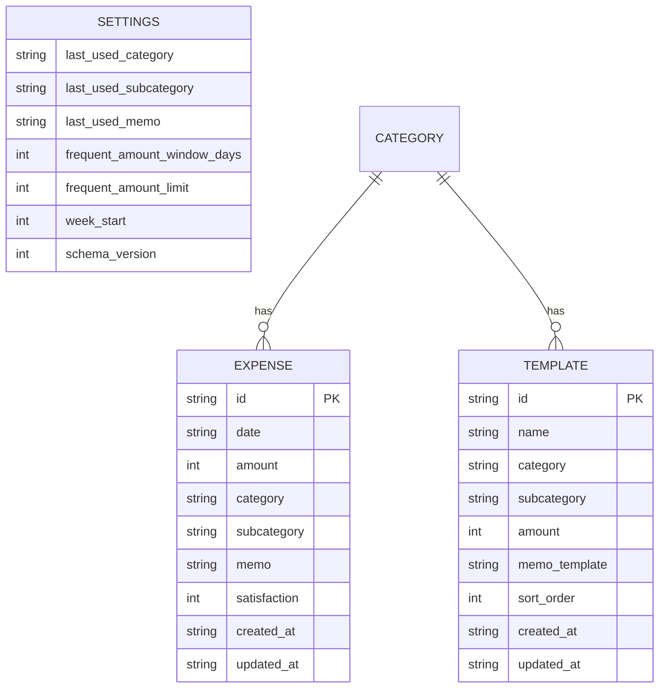

# 技術設計書

## 概要

**目的**: 本フィーチャーは、交通費・交際費の最短入力による記録、一覧管理、集計分析、データエクスポート/バックアップ機能を提供し、継続的な支出管理を可能にする。

**ユーザー**: 個人ユーザーが日常の交通費・交際費を手軽に記録・分析するために使用する。ログイン不要でスマホから即座にアクセスできることを重視する。

**影響**: 新規PWAアプリケーションとして構築。既存システムへの影響なし。

### ゴール
- 支出入力を3〜6タップ、10秒以内で完了できる導線
- オフライン環境でも全機能が動作するPWA
- 数千件のデータでも体感待ちなしのパフォーマンス
- プライバシー保護（データは端末内のみ保存）

### 非ゴール
- クラウド同期/ログイン機能
- レシート撮影・OCR
- 複数通貨・複数ユーザー対応
- 高度な検索機能

---

## アーキテクチャ

### アーキテクチャパターン & バウンダリマップ



**アーキテクチャ統合**:
- **選定パターン**: シンプルレイヤードアーキテクチャ - MVPスコープに適切、将来拡張可能
- **ドメイン境界**: UI/Application/Domain/Infrastructureの4層で責務分離
- **新規コンポーネント根拠**: 各サービスは単一責務原則に従い、テスタビリティ確保

### 技術スタック

| レイヤー | 選定技術/バージョン | 役割 | 備考 |
|---------|-------------------|------|------|
| フロントエンド | React 18.x + TypeScript 5.x | UIコンポーネント構築 | Strict Mode有効 |
| ビルドツール | Vite 5.x | 開発サーバー・バンドル | HMR高速化 |
| PWA | vite-plugin-pwa 0.20.x | Service Worker/Manifest生成 | Workbox統合 |
| スタイリング | Tailwind CSS 3.x | ユーティリティファーストCSS | モバイル最適化 |
| 日付処理 | dayjs 1.x | 日付操作・フォーマット | 軽量(2KB) |
| UUID生成 | crypto.randomUUID() | 一意識別子生成 | ブラウザ標準API |
| データ保存 | localStorage | 永続化ストレージ | StorageAdapter経由 |
| ルーティング | React Router 6.x | ページ遷移管理 | - |

---

## システムフロー

### 支出登録フロー



**主要決定事項**:
- 頻出金額候補は保存成功時に再計算してキャッシュ
- 前回入力値は設定として保存し、次回入力時に自動反映

### JSON復元フロー



---

## 要件トレーサビリティ

| 要件ID | 概要 | コンポーネント | インターフェース | フロー |
|--------|------|---------------|-----------------|--------|
| 1.1-1.10 | 支出新規登録 | AddPage, ExpenseForm, ExpenseService | ExpenseService.create() | 支出登録フロー |
| 2.1-2.4 | 区分・サブ区分 | CategorySelector | CategoryConfig | - |
| 3.1-3.6 | 一覧表示 | ListPage, ExpenseList, FilterPanel | ExpenseService.list() | - |
| 4.1-4.5 | 編集 | EditModal, ExpenseForm | ExpenseService.update() | - |
| 5.1-5.4 | 削除 | DeleteConfirmDialog | ExpenseService.delete() | - |
| 6.1-6.4 | 月次・期間集計 | SummaryPage, AggregationPanel | AggregationService | - |
| 7.1-7.5 | 満足度集計 | SatisfactionStats | AggregationService | - |
| 8.1-8.4 | 気づき機能 | InsightsPanel | AggregationService | - |
| 9.1-9.5 | テンプレート管理 | TemplateManager | TemplateService | - |
| 10.1-10.5 | CSV出力 | CsvExportPanel | ExportService.exportCsv() | - |
| 11.1-11.3 | JSONバックアップ | BackupPanel | ExportService.exportJson() | - |
| 12.1-12.6 | JSON復元 | RestorePanel | ExportService.importJson() | JSON復元フロー |
| 13.1-13.3 | 全削除 | DangerZone | ExportService.deleteAll() | - |
| 14.1-14.4 | PWA対応 | ServiceWorker, Manifest | vite-plugin-pwa | - |
| 15.1-15.4 | データ保存 | StorageAdapter | StorageAdapter | - |
| 16.1-16.5 | UI/UX | 全UIコンポーネント | - | - |

---

## コンポーネントとインターフェース

### コンポーネントサマリー

| コンポーネント | ドメイン/レイヤー | 目的 | 要件カバレッジ | 主要依存 | コントラクト |
|---------------|-----------------|------|---------------|----------|-------------|
| AddPage | UI/Pages | 支出新規登録画面 | 1.1-1.10 | ExpenseService (P0) | State |
| ListPage | UI/Pages | 支出一覧画面 | 3.1-3.6, 4.1-4.5, 5.1-5.4 | ExpenseService (P0) | State |
| SummaryPage | UI/Pages | 集計・分析画面 | 6.1-6.4, 7.1-7.5, 8.1-8.4 | AggregationService (P0) | State |
| SettingsPage | UI/Pages | 設定・データ管理画面 | 9-13 | TemplateService, ExportService (P0) | State |
| ExpenseService | Application | 支出CRUD操作 | 1, 3, 4, 5 | StorageAdapter (P0) | Service |
| TemplateService | Application | テンプレートCRUD | 9 | StorageAdapter (P0) | Service |
| AggregationService | Application | 集計計算 | 6, 7, 8 | StorageAdapter (P0) | Service |
| ExportService | Application | エクスポート/インポート | 10, 11, 12, 13 | StorageAdapter (P0) | Service |
| StorageAdapter | Infrastructure | localStorage抽象化 | 15 | localStorage (P0) | Service |

---

### Application Layer

#### ExpenseService

| フィールド | 詳細 |
|----------|------|
| 目的 | 支出データのCRUD操作と頻出金額計算を提供 |
| 要件 | 1.1-1.10, 3.1-3.6, 4.1-4.5, 5.1-5.4 |

**責務と制約**
- 支出データの作成・読取・更新・削除
- バリデーション（金額>0、日付形式、満足度1-5またはnull）
- 頻出金額候補の計算（直近90日、上位5件）

**依存関係**
- Outbound: StorageAdapter - データ永続化 (P0)

**コントラクト**: Service [x]

##### サービスインターフェース

```typescript
interface Expense {
  id: string;
  date: string; // YYYY-MM-DD
  amount: number; // 1以上の整数
  category: 'transport' | 'social';
  subcategory: string;
  memo: string | null;
  satisfaction: 1 | 2 | 3 | 4 | 5 | null;
  created_at: string; // ISO8601
  updated_at: string; // ISO8601
}

interface ExpenseCreateInput {
  date: string;
  amount: number;
  category: 'transport' | 'social';
  subcategory: string;
  memo?: string | null;
  satisfaction?: 1 | 2 | 3 | 4 | 5 | null;
}

interface ExpenseUpdateInput extends Partial<ExpenseCreateInput> {
  id: string;
}

interface ExpenseFilter {
  startDate?: string;
  endDate?: string;
  category?: 'transport' | 'social';
  subcategory?: string;
}

interface FrequentAmount {
  amount: number;
  count: number;
}

type ExpenseError = 
  | { type: 'VALIDATION_ERROR'; field: string; message: string }
  | { type: 'NOT_FOUND'; id: string }
  | { type: 'STORAGE_ERROR'; message: string };

interface ExpenseService {
  create(input: ExpenseCreateInput): Result<Expense, ExpenseError>;
  update(input: ExpenseUpdateInput): Result<Expense, ExpenseError>;
  delete(id: string): Result<void, ExpenseError>;
  getById(id: string): Result<Expense, ExpenseError>;
  list(filter?: ExpenseFilter): Result<Expense[], ExpenseError>;
  getFrequentAmounts(): FrequentAmount[]; // 上位5件【固定】
}
```

- 事前条件: 入力値がバリデーションを通過すること
- 事後条件: 保存成功時に頻出金額キャッシュを再計算
- 不変条件: 金額は常に1以上、満足度は1-5またはnull

**実装ノート**
- 頻出金額計算は直近90日【固定】のデータを対象
- 保存成功時に設定（last_used_*）を更新

---

#### TemplateService

| フィールド | 詳細 |
|----------|------|
| 目的 | テンプレートのCRUD操作と並び替えを提供 |
| 要件 | 9.1-9.5 |

**責務と制約**
- テンプレートの作成・読取・更新・削除
- 並び順の管理

**依存関係**
- Outbound: StorageAdapter - データ永続化 (P0)

**コントラクト**: Service [x]

##### サービスインターフェース

```typescript
interface Template {
  id: string;
  name: string;
  category: 'transport' | 'social';
  subcategory: string;
  amount: number | null;
  memo_template: string | null;
  sort_order: number;
  created_at: string;
  updated_at: string;
}

interface TemplateCreateInput {
  name: string;
  category: 'transport' | 'social';
  subcategory: string;
  amount?: number | null;
  memo_template?: string | null;
}

interface TemplateService {
  create(input: TemplateCreateInput): Result<Template, TemplateError>;
  update(id: string, input: Partial<TemplateCreateInput>): Result<Template, TemplateError>;
  delete(id: string): Result<void, TemplateError>;
  list(): Template[];
  reorder(orderedIds: string[]): Result<void, TemplateError>;
}
```

---

#### AggregationService

| フィールド | 詳細 |
|----------|------|
| 目的 | 支出データの集計・分析計算を提供 |
| 要件 | 6.1-6.4, 7.1-7.5, 8.1-8.4 |

**責務と制約**
- 期間別・カテゴリ別の合計計算
- 満足度の平均・分布・推移計算
- 気づき指標の計算

**依存関係**
- Outbound: StorageAdapter - データ読取 (P0)

**コントラクト**: Service [x]

##### サービスインターフェース

```typescript
interface AggregationPeriod {
  startDate: string;
  endDate: string;
}

interface CategorySummary {
  transport: number;
  social: number;
  total: number;
}

interface SubcategorySummary {
  subcategory: string;
  amount: number;
  percentage: number;
}

interface SatisfactionStats {
  average: number | null; // 満足度が1件もなければnull
  distribution: Record<1 | 2 | 3 | 4 | 5, number>;
  trend: Array<{ date: string; average: number | null }>;
}

interface Insights {
  taxiRatio: number | null; // 交通費に占めるタクシー比率
  topSocialDays: Array<{ date: string; amount: number }>; // TOP3【固定】
  weeklyComparison: { thisWeek: number; lastWeek: number; change: number };
  categoryBias: Array<{ subcategory: string; percentage: number }>;
}

interface AggregationService {
  getCategorySummary(period: AggregationPeriod): CategorySummary;
  getSubcategoryBreakdown(period: AggregationPeriod, category?: 'transport' | 'social'): SubcategorySummary[];
  getSatisfactionStats(period: AggregationPeriod): SatisfactionStats;
  getInsights(period: AggregationPeriod): Insights;
}
```

- 不変条件: サブ区分別内訳の総和 = カテゴリ合計

---

#### ExportService

| フィールド | 詳細 |
|----------|------|
| 目的 | CSV/JSONエクスポート、バックアップ復元、全削除を提供 |
| 要件 | 10.1-10.5, 11.1-11.3, 12.1-12.6, 13.1-13.3 |

**責務と制約**
- CSV形式でのデータエクスポート（期間指定）
- JSON形式での全データバックアップ
- JSONからの全削除置き換え復元
- 全データ削除

**依存関係**
- Outbound: StorageAdapter - データ読取・書込 (P0)

**コントラクト**: Service [x]

##### サービスインターフェース

```typescript
interface BackupData {
  schemaVersion: number;
  exportedAt: string;
  expenses: Expense[];
  templates: Template[];
  settings: Settings;
}

type ExportError =
  | { type: 'INVALID_FORMAT'; message: string }
  | { type: 'SCHEMA_MISMATCH'; expected: number; actual: number }
  | { type: 'STORAGE_ERROR'; message: string };

interface ExportService {
  exportCsv(period: AggregationPeriod): string; // CSV文字列
  exportJson(): BackupData;
  validateBackup(data: unknown): Result<BackupData, ExportError>;
  importJson(data: BackupData): Result<void, ExportError>; // 全削除して置き換え
  deleteAll(): Result<void, ExportError>;
}
```

- 事前条件: importJson実行前にvalidateBackupで検証済みであること
- 事後条件: importJson後、全データがBackupDataの内容に置き換わる

**実装ノート**
- CSV列形式【固定】: `date,amount,category,subcategory,memo,satisfaction`
- 満足度未設定時はCSVで空文字

---

### Infrastructure Layer

#### StorageAdapter

| フィールド | 詳細 |
|----------|------|
| 目的 | localStorageへのアクセスを抽象化し、将来のIndexedDB移行を容易にする |
| 要件 | 15.1-15.4 |

**責務と制約**
- localStorage読み書きの一元管理
- JSON直列化/逆直列化
- エラーハンドリング（QuotaExceededError等）

**依存関係**
- External: localStorage - ブラウザAPI (P0)

**コントラクト**: Service [x]

##### サービスインターフェース

```typescript
type StorageKey = 'te:expenses' | 'te:templates' | 'te:settings';

type StorageError =
  | { type: 'QUOTA_EXCEEDED'; message: string }
  | { type: 'PARSE_ERROR'; message: string }
  | { type: 'UNKNOWN'; message: string };

interface StorageAdapter {
  get<T>(key: StorageKey): Result<T | null, StorageError>;
  set<T>(key: StorageKey, value: T): Result<void, StorageError>;
  remove(key: StorageKey): Result<void, StorageError>;
  clear(): Result<void, StorageError>;
}
```

- 事前条件: keyはStorageKeyの有効な値であること
- 不変条件: 保存データは常にJSON形式

**実装ノート**
- localStorageキー接頭辞 `te:` で名前空間を分離
- 将来IndexedDB実装を追加する際は同一インターフェースを維持

---

### UI Layer

#### 共通Props定義

```typescript
interface BasePageProps {
  className?: string;
}

interface ConfirmDialogProps {
  isOpen: boolean;
  title: string;
  message: string;
  confirmLabel: string;
  cancelLabel: string;
  onConfirm: () => void;
  onCancel: () => void;
  variant?: 'default' | 'danger';
}
```

#### AddPage
- 目的: 支出新規登録画面
- 要件: 1.1-1.10
- `BasePageProps`を継承
- 実装ノート: テンプレチップ、頻出金額チップをフォーム上部に配置

#### ListPage
- 目的: 支出一覧・編集・削除画面
- 要件: 3.1-3.6, 4.1-4.5, 5.1-5.4
- `BasePageProps`を継承
- 実装ノート: フィルタはドロワーまたはモーダルで提供

#### SummaryPage
- 目的: 集計・満足度分析・気づき画面
- 要件: 6.1-6.4, 7.1-7.5, 8.1-8.4
- `BasePageProps`を継承
- 実装ノート: タブまたはアコーディオンで集計/満足度/気づきを切り替え

#### SettingsPage
- 目的: テンプレ管理・エクスポート・バックアップ・復元・全削除
- 要件: 9-13
- `BasePageProps`を継承
- 実装ノート: 全削除は「危険な操作」セクションに分離

---

## データモデル

### ドメインモデル



### 論理データモデル

**Expense（支出）**
| フィールド | 型 | 必須 | 制約 |
|-----------|-----|------|------|
| id | UUID | 必須 | 一意 |
| date | string | 必須 | YYYY-MM-DD形式 |
| amount | integer | 必須 | >= 1 |
| category | string | 必須 | 'transport' または 'social' |
| subcategory | string | 必須 | カテゴリに対応した値 |
| memo | string / null | 任意 | 最大200文字【固定】 |
| satisfaction | integer / null | 任意 | 1-5 |
| created_at | string | 必須 | ISO8601 |
| updated_at | string | 必須 | ISO8601 |

**Template（テンプレ）**
| フィールド | 型 | 必須 | 制約 |
|-----------|-----|------|------|
| id | UUID | 必須 | 一意 |
| name | string | 必須 | 表示名 |
| category | string | 必須 | 'transport' または 'social' |
| subcategory | string | 必須 | カテゴリに対応した値 |
| amount | integer / null | 任意 | >= 1 |
| memo_template | string / null | 任意 | - |
| sort_order | integer | 必須 | 並び順 |
| created_at | string | 必須 | ISO8601 |
| updated_at | string | 必須 | ISO8601 |

**Settings（設定）**
| フィールド | 型 | デフォルト | 備考 |
|-----------|-----|-----------|------|
| last_used_category | string | 'transport' | - |
| last_used_subcategory | string | 'train' | - |
| last_used_memo | string | '' | - |
| frequent_amount_window_days | integer | 90 | 【固定】 |
| frequent_amount_limit | integer | 5 | 【固定】 |
| week_start | integer | 1 | 【初期値】0-6 |
| schema_version | integer | 1 | - |

### 物理データモデル（localStorage）

**キー設計**
| キー | 内容 | 形式 |
|-----|------|------|
| `te:expenses` | 支出配列 | JSON配列 |
| `te:templates` | テンプレ配列 | JSON配列 |
| `te:settings` | 設定オブジェクト | JSONオブジェクト |

### データコントラクト

**CSVエクスポート形式【固定】**
```
date,amount,category,subcategory,memo,satisfaction
2026-01-12,1200,social,meal,ランチ,4
2026-01-12,980,transport,train,新宿→渋谷,
```

**JSONバックアップ形式**
```typescript
interface BackupData {
  schemaVersion: number;
  exportedAt: string; // ISO8601
  expenses: Expense[];
  templates: Template[];
  settings: Settings;
}
```

---

## エラーハンドリング

### エラー戦略
- **早期失敗**: バリデーションはフォーム送信前に実施
- **優雅な劣化**: 頻出金額計算失敗時は空配列で継続
- **ユーザーコンテキスト**: 具体的なエラーメッセージと対処方法を提示

### エラーカテゴリと対応

| カテゴリ | 例 | 対応 |
|---------|-----|------|
| バリデーションエラー | 金額0以下、必須未入力 | フィールドハイライト + メッセージ |
| ストレージエラー | QuotaExceeded | トースト通知 + バックアップ促進 |
| 復元エラー | 形式不正、バージョン不一致 | エラーダイアログ + 詳細説明 |

### モニタリング
- コンソールログ出力（開発環境）
- 保存失敗時のユーザー通知

---

## テスト戦略

### ユニットテスト
- ExpenseService: create/update/delete、バリデーション、頻出金額計算
- AggregationService: 集計計算、満足度統計、気づき指標
- ExportService: CSV生成、JSON生成、バックアップ検証
- StorageAdapter: get/set/remove、エラーハンドリング

### 統合テスト
- 支出登録→一覧表示→編集→削除フロー
- バックアップ→全削除→復元フロー
- CSV出力→内容検証

### E2Eテスト
- 支出登録の最短経路（テンプレ使用）
- オフライン時の動作確認
- PWAインストールフロー

### パフォーマンステスト
- 1000件データでの一覧表示速度
- 1000件データでの集計計算速度

---

## パフォーマンス & スケーラビリティ

### ターゲット指標
- 一覧表示: 100ms以内（1000件）
- 集計計算: 200ms以内（1000件）
- 初回ロード: 3秒以内（3G回線想定）

### 最適化手法
- React.memoによる不要再レンダリング防止
- useMemoによる集計結果キャッシュ
- 仮想スクロール（将来検討、MVP不要）

### キャッシュ戦略（PWA）
- アプリシェル: Cache-First
- 静的アセット: Stale-While-Revalidate
