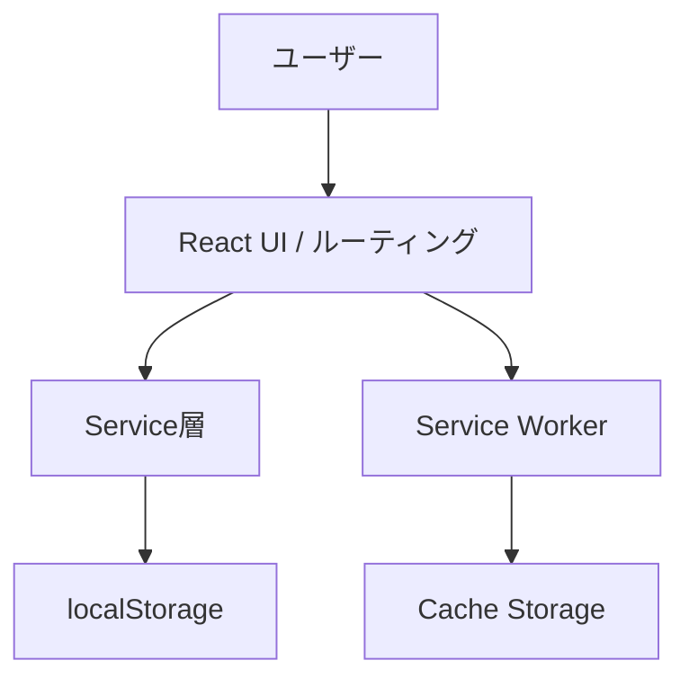

# Expense Tracker PWA

## 概要

目的: 交通費・交際費を最短入力で記録し、月次/期間で把握できるようにする。
解決する課題: 入力が面倒で続かない、手元で素早く集計したい。
できること:

- 最短入力（テンプレ/頻出金額/前回値の引き継ぎ）
- 一覧の編集/削除とフィルタ（今月/先月/月指定/区分）
- 月次・期間集計と満足度/軽量分析
- CSV出力
- PWA対応（ホーム画面追加、オフライン動作）
  想定ユーザー: 個人で交通費・交際費をスマホ中心に管理したい人。

## 技術スタック

- Frontend: React 19 / TypeScript 5 / Vite 7, React Router, Tailwind CSS
- Backend: N/A（クライアントのみ）
- DB: localStorage
- Auth: なし
- Infra: Firebase Hosting
- Others: Vite PWA Plugin, Vitest, ESLint, Prettier, Day.js

## アーキテクチャ概要

クライアントのみで動作するローカルファーストPWA。UIはReact、ビジネスロジックはService層で集約し、端末内のlocalStorageに保存する。



## セットアップ

- Node.js（ES Modules対応）
- npm（package-lock.jsonに準拠）
- Git
- Firebase CLI（デプロイ時のみ）

## クイックスタート


1. 依存関係をインストールする

```bash
npm install
```

2. 開発サーバーを起動する

```bash
npm run dev
```

3. ブラウザで http://localhost:5173 を開く

## ローカル開発

起動:

```bash
npm run dev
```

よくあるつまずき:

- 5173番ポートが使用中の場合、Viteが別ポートに切り替える。
- PWAのService Workerで更新が反映されない場合は、DevToolsのApplication > Service Workersで登録解除する。
- localStorageの削除やブラウザデータ消去でデータが失われるため、定期的にJSONバックアップを行う。
- シークレットモードやストレージ制限により保存できない場合がある。

## デプロイ

Firebase Hostingを利用。

1. 本番ビルドを生成する

```bash
npm run build
```

2. Firebaseにデプロイする

```bash
firebase deploy
```

補足:

- `firebase.json` は `dist` を公開ディレクトリとして使用。
- Firebaseプロジェクトへのデプロイ権限が必要。
- マイグレーション運用は不要。
